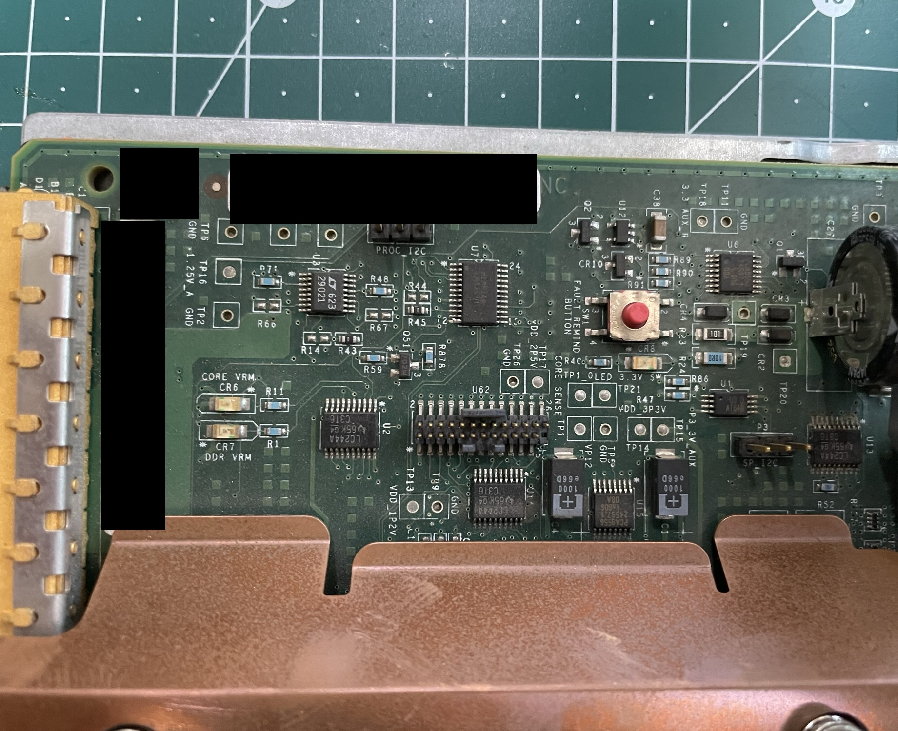
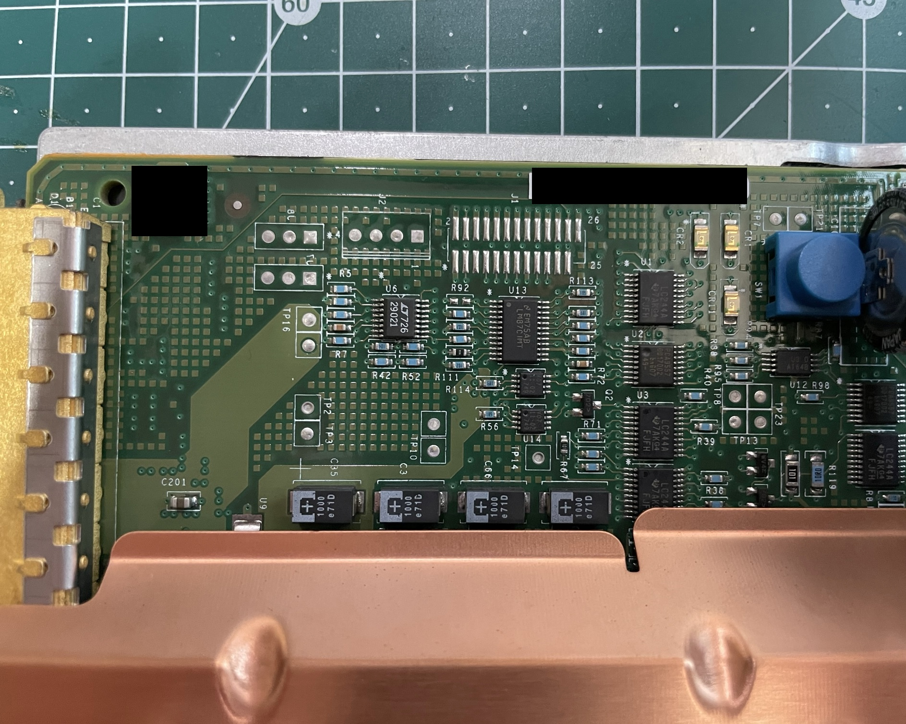

# AMD 25-pin HDT
## Populated

## Not populated

## Connector Pinout

| **Pin** | **Name**      | **Notes**                            |
|---------|---------------|--------------------------------------|
| 1       | GND           |                                      |
| 2       | GND           |                                      |
| 3       | NC            | No connect                           |
| 4       | GND           |                                      |
| 5       | NC            | No connect                           |
| 6       | GND           |                                      |
| 7       | CPU_DBREQ#    |                                      |
| 8       | GND           |                                      |
| 9       | CPU_DBRDY     |                                      |
| 10      | GND           |                                      |
| 11      | CPU_TCK       |                                      |
| 12      | GND           |                                      |
| 13      | CPU_TMS       |                                      |
| 14      | GND           |                                      |
| 15      | CPU_TDI       |                                      |
| 16      | GND           |                                      |
| 17      | CPU_TRST#     |                                      |
| 18      | GND           |                                      |
| 19      | CPU_TDO       |                                      |
| 20      | GND           |                                      |
| 21      | CPU_VDDIO_SUS |                                      |
| 22      | GND           |                                      |
| 23      | CPU_VDDIO_SUS |                                      |
| 24      | CPU_LDT_RST#  |                                      |
| 25      | KEY           | Keying pin, may be absent or blocked |
| 26      | GND           |                                      |
