# Applied Microsystems CodeTAP
## Hardware
### Main
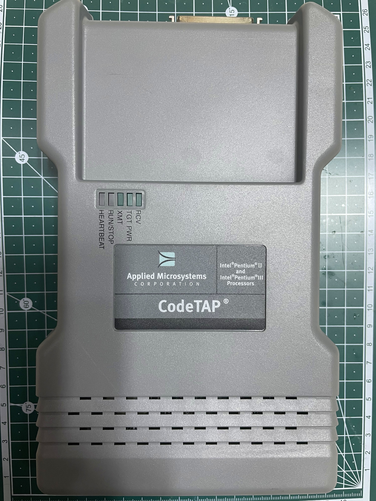

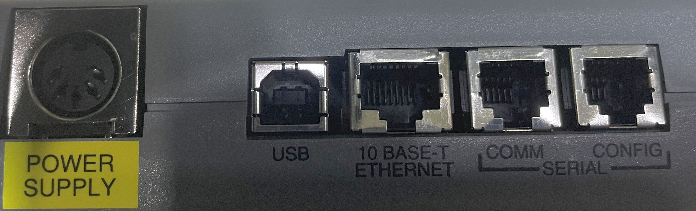

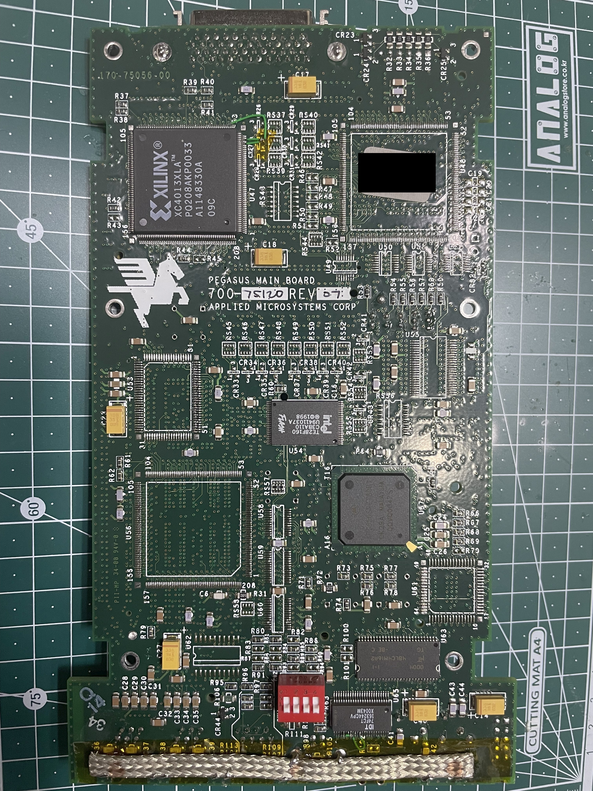
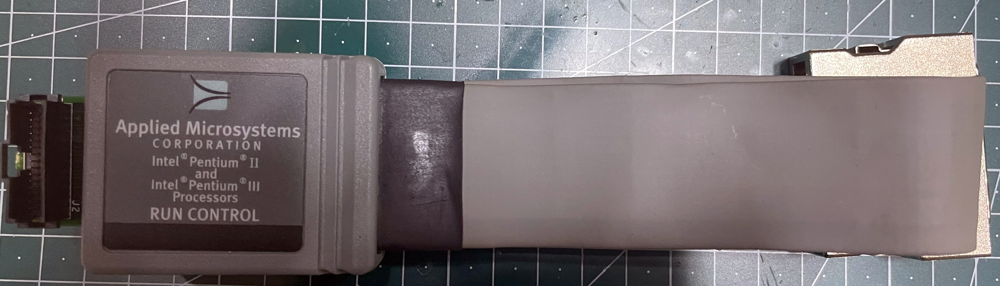
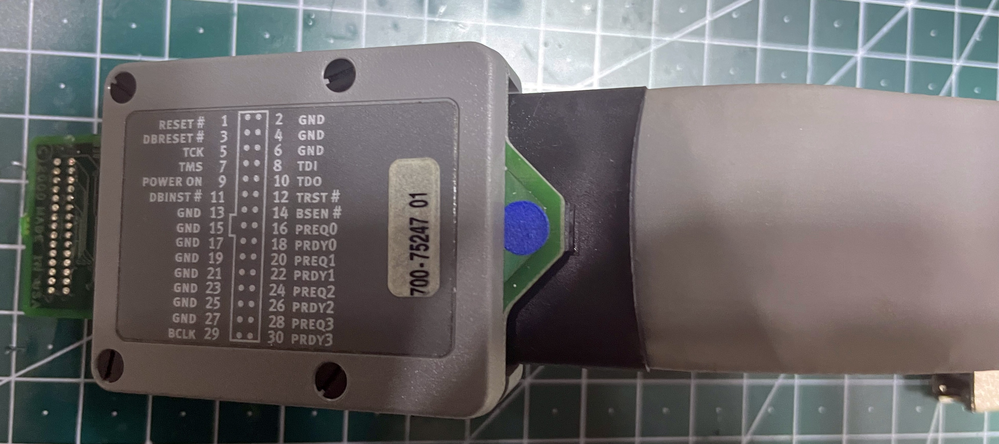
### Probetip
#### rev00
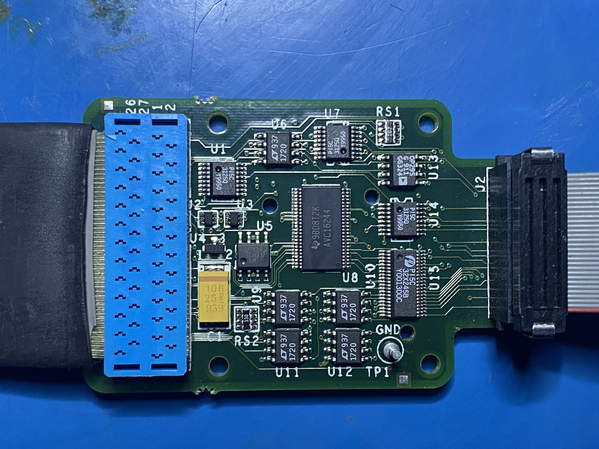
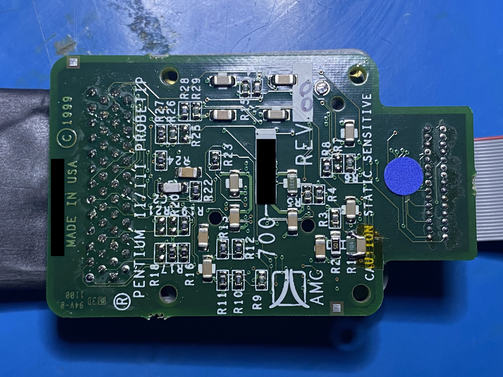
#### rev01
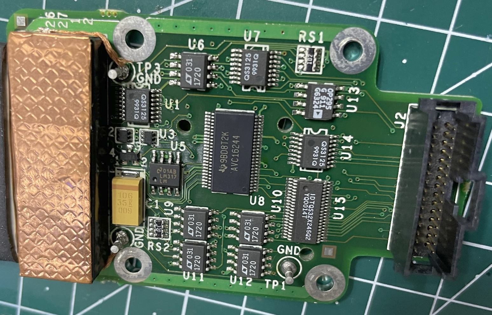
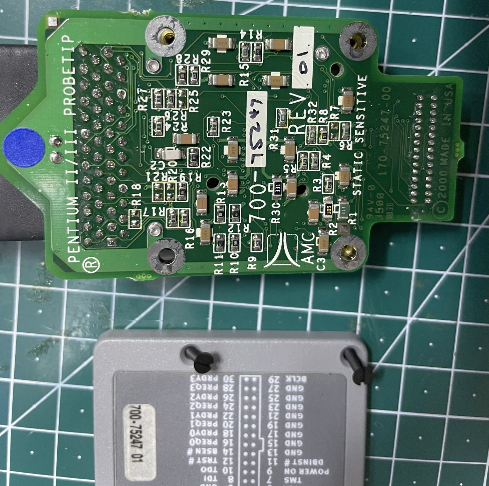
### Power Supply
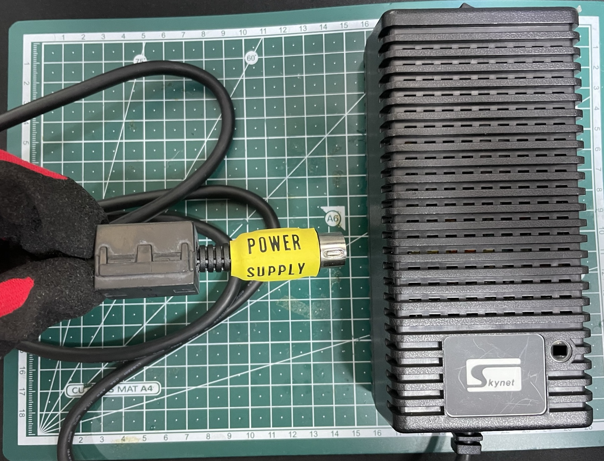
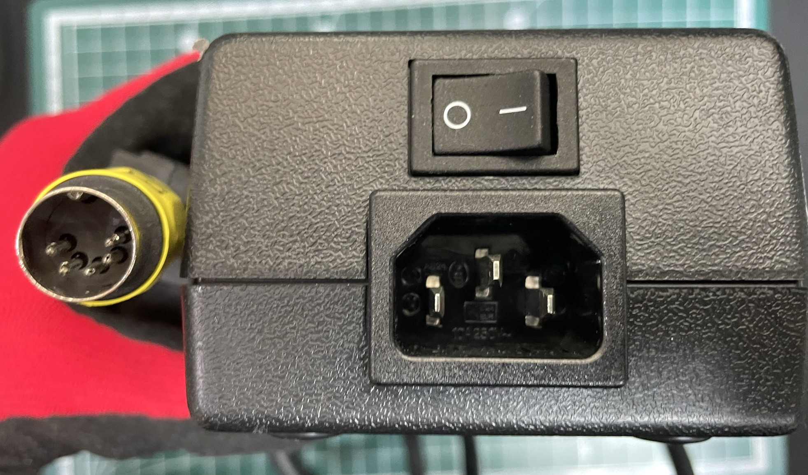
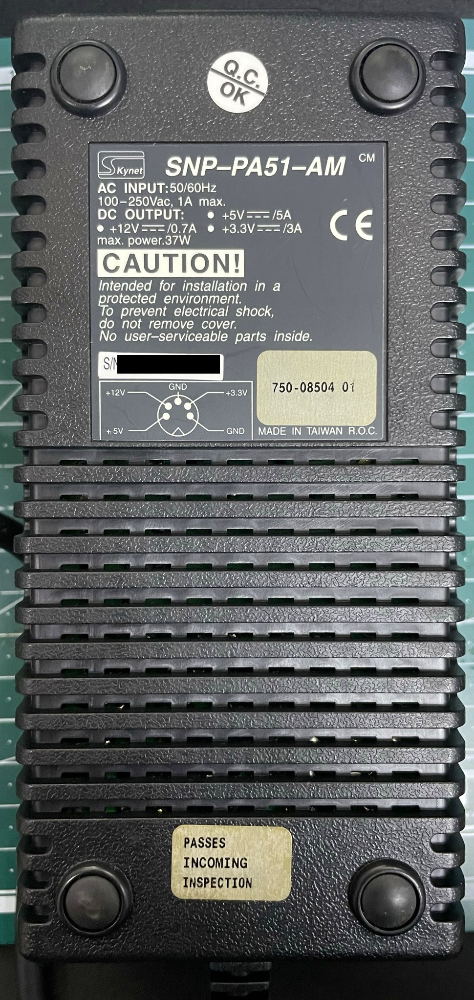
### Commkit Part Number
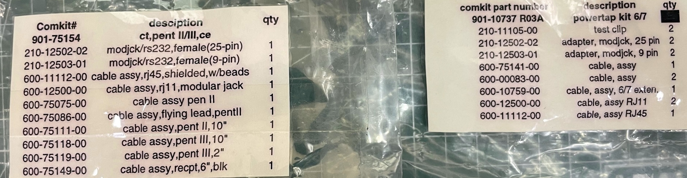
## Firmware
* Processor type: PowerPC (MPC850) big endian
* OS: Ecore Firmware (Wind River Systems VxWorks variant?)
