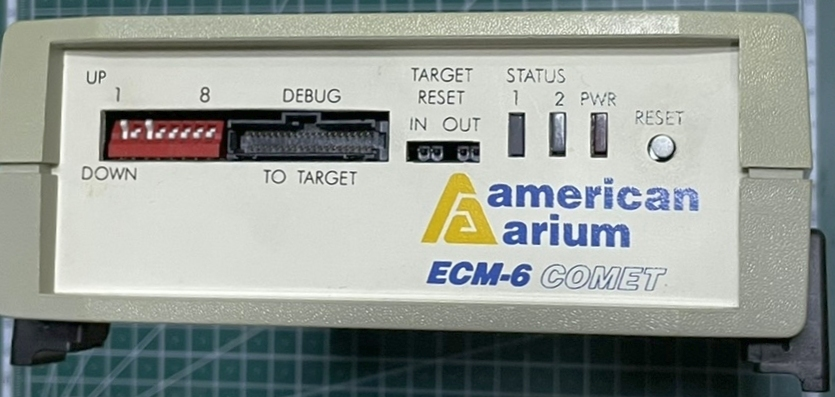
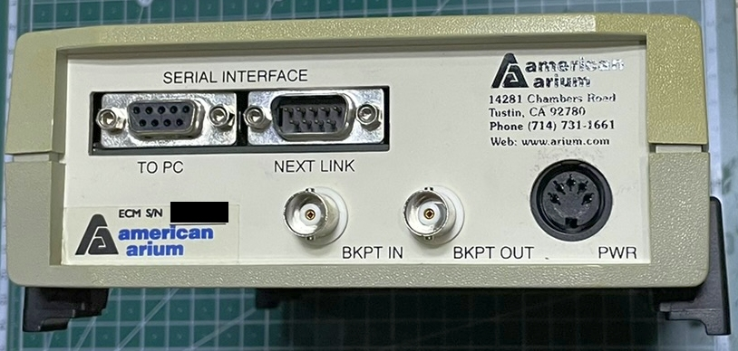
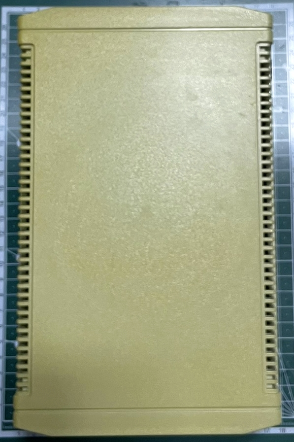
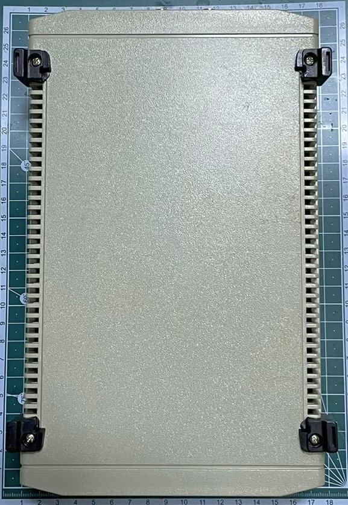
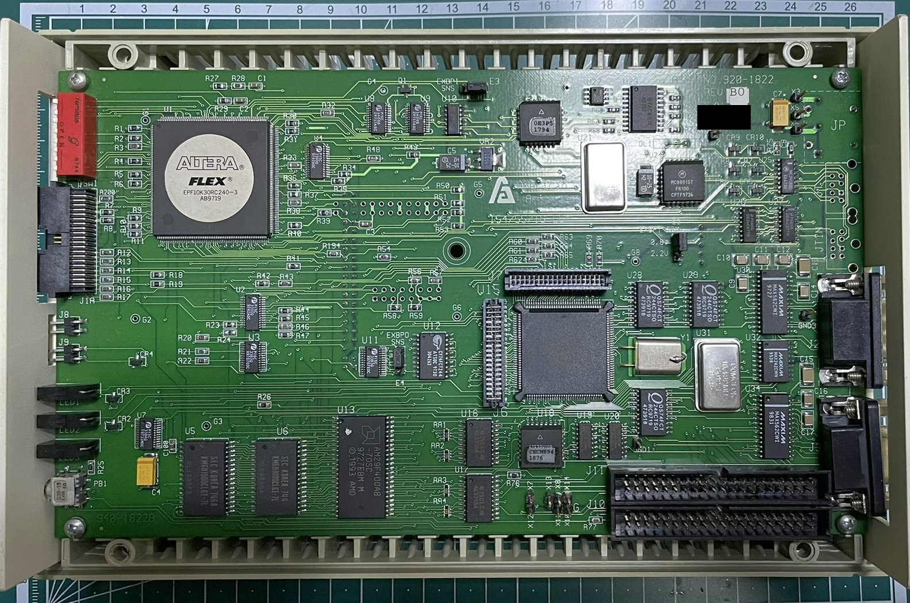
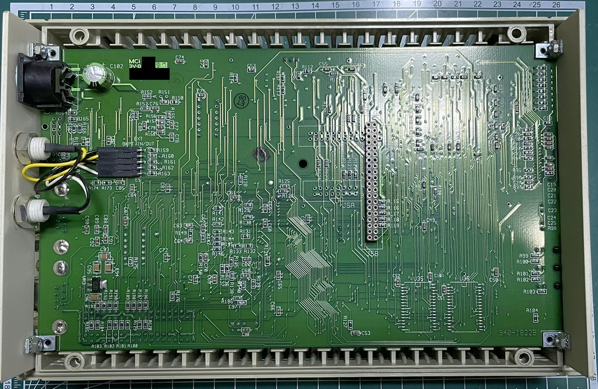
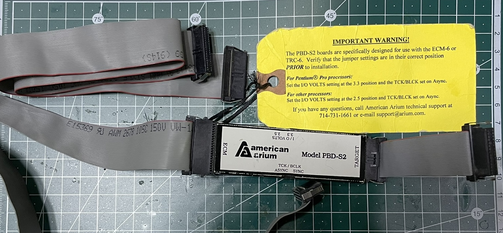
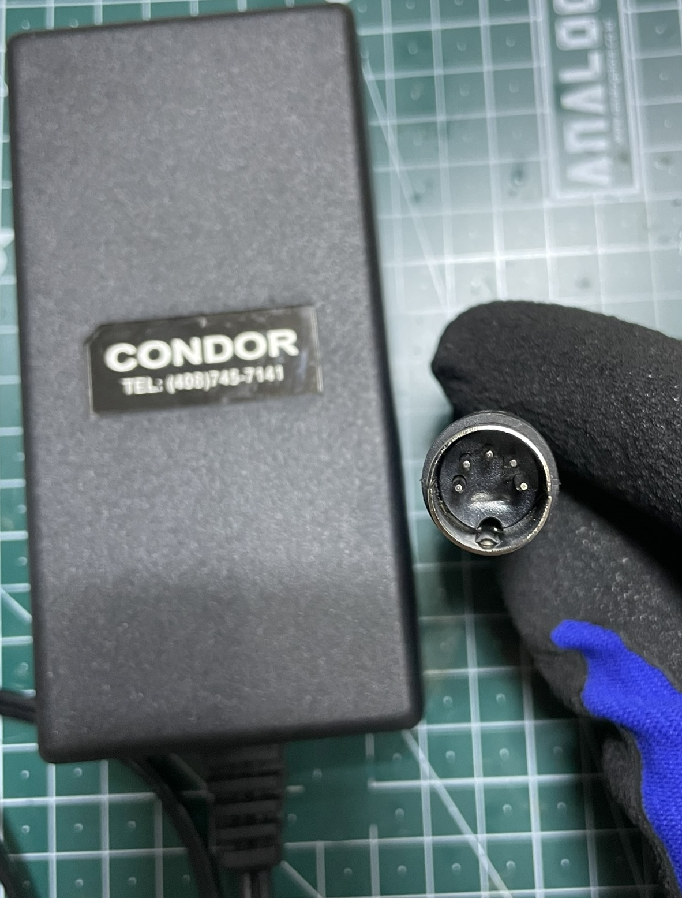
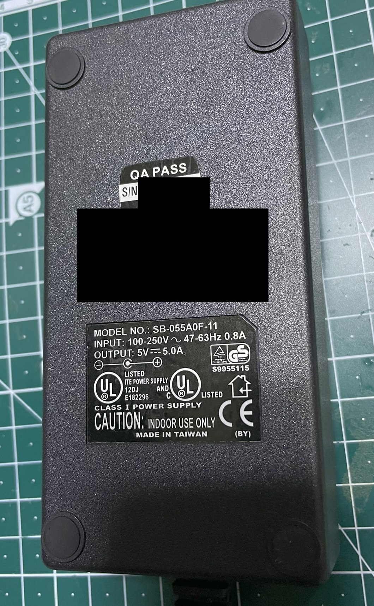

# American Arium ECM-6
## Hardware
### Main

### Personality Module

* TODO: More details (e.g. back/front pictures of the PCB)
### Power Supply

## Firmware
* Processor type: MC68302FC16
* OS: ?
