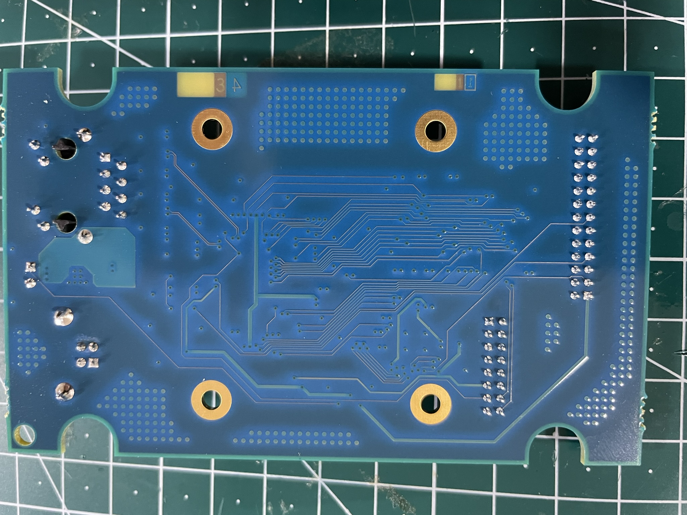

# Sage Electronic Engineering SmartProbe

# Technical Overview
## Hardware
- TI/Stellaris LM3S9B90 microcontroller
- Actel AGLN010 FPGA/CPLD
- Winbond W9864G6JH 1M x 4B x 16 bits DRAM
- USB/Ethernet Connectivity
- Embedded 16-pin header, extended support header (26-pin, is not regular HDT header).
## Software
- FPGA Updated via DirectC (Actel/Microsemi update library for ISP)
- LWIP stack for Ethernet
- Stellaris ROM for support functions
- Note : certain LM3S9B90 IC revisions have broken ROMS, so StellarisWare is probably integrated into the FW flash image to replace it. There are 2 different FW versions (at least).

# Pinouts
## Little HDT/Embbeded HDT connector (16 pins)
| **Pin**                                                                        | **Name**   | **Connection(s)** | **Notes**                                                                   |
|--------------------------------------------------------------------------------|------------|-------------------|-----------------------------------------------------------------------------|
| **1**                                                                          | APU_DBRDY  | Fpga Pin 4        | JTAG to debugged device                                                     |
| **2**                                                                          | APU_TDO    | Fpga Pin 3        | JTAG to debugged device                                                     |
| **3**                                                                          | GND        | -                 | -                                                                           |
| **4**                                                                          | APU_TDI    | Fpga Pin 2        | Debugged device may pull high to VCC via 1k                                 |
| **5**                                                                          | GND        | -                 | -                                                                           |
| **6**                                                                          | APU_TMS    | Fpga Pins 1,41    | Debugged device may pull high to VCC via 1k - double-driven by I/O on FPGA  |
| **7**                                                                          | GND        | -                 | -                                                                           |
| **8**                                                                          | APU_TCK    | Fpga Pins 42,48   | Debugged device may pull high to VCC via 1k - double-driven by I/O on FPGA  |
| **9**                                                                          | APU_DBREQ# | Fpga Pins 43,47   | Debugged device may pull high to VCC via 330 - double-driven by I/O on FPGA |
| **10**                                                                         | PWR_BTN#   | µC Pin 5          | Power Button pin for ACPI Reset simulation/request?                         |
| **11**                                                                         | 1.8V/VCC   | µC Pin 96         | Provided by debugged Device, FPGA VCCIB1 supply                             |
| **12**                                                                         | SYS_RST#   | µC Pin 1          |                                                                             |
| **13**                                                                         | LDT_RST#   | µC Pins 95,47     | Southbridge outputs signal to indicate reset, input on board                |
| **14**                                                                         | SCL1       | µC Pin 26         | I2C Slave 1 SCL                                                             |
| **15**                                                                         | GND        | -                 | -                                                                           |
| **16**                                                                         | SDA1       | µC Pin 27         |  I2C Slave 1 SDA                                                            |

**Note : APU_TRST# (on device to be debugged's board is pulled up to 1.8V/VCC by 1k**

## Big HDT/Personality Expansion connector (26 pins)
| **Pin** | **Name** | **Connection(s)** | **Notes**                                 |
|---------|----------|-------------------|-------------------------------------------|
| **1**   | 5V       | 5V, µC Pin 67     | 5V, possibly to power "personality board" |
| **2**   |          | Fpga Pin 7        | Unknown Function                           |
| **3**   |          | Fpga Pin  44      | Unknown Function                           |
| **4**   |          | Fpga Pin 8        | Unknown Function                           |
| **5**   | GND      | -                 | -                                         |
| **6**   |          | Fpga Pin 9        | Unknown Function                           |
| **7**   |          | µC Pin 72         | Unknown Function                           |
| **8**   |          | Fpga Pin 10       | Unknown Function                           |
| **9**   |          | Fpga Pin 45       | Unknown Function                           |
| **10**  |          | Fpga Pin 11       | Unknown Function                           |
| **11**  | GND      | -                 | -                                         |
| **12**  |          | Fpga Pin 12       | Unknown Function                           |
| **13**  |          | µC Pin 65         | Unknown Function                           |
| **14**  |          | Fpga Pin 13       | Unknown Function                           |
| **15**  |          | Fpga Pin 46       | Unknown Function                           |
| **16**  |          | Fpga Pin 14       | Unknown Function                           |
| **17**  | GND      | -                 | -                                         |
| **18**  |          | Fpga Pin 15       | Unknown Function                           |
| **19**  | GND      | -                 | -                                         |
| **20**  |          | Fpga Pin 16       | Unknown Function                           |
| **21**  | GND      | -                 | -                                         |
| **22**  |          | Fpga Pin 17       | Unknown Function                           |
| **23**  | GND      | -                 | -                                         |
| **24**  |          | Fpga Pin 20       | Unknown Function                           |
| **25**  | GND      | -                 | -                                         |
| **26**  |          | Fpga Pin 21       | Unknown Function                           |

**Note : This is NOT a 26-pin HDT connector**

