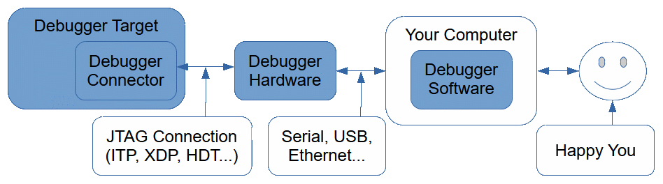

# x86 JTAG Information

## Overview

## Debugger Hardware
### Intel
* [Applied Microsystems CodeTAP](./Hardware/CodeTAP.md)
* ASSET InterTech (American Arium)
    * [ECM-6](./Hardware/ECM-6.md)
    * [ECM-S2](./Hardware/ECM-S2.md)
    * [ECM-20](./Hardware/ECM-20.md)
    * [TRC-20](./Hardware/TRC-20.md)
    * [ECM-50](./Hardware/ECM-50.md)
    * [ECM-700 revA5](./Hardware/ECM-700_revA5.md)
    * [ECM-XDP](./Hardware/ECM-XDP.md)
    * [ECM-XDP3 revB2](./Hardware/ECM-XDP3_revB2.md)
    * [ECM-XDP3e](./Hardware/ECM-XDP3e.md)
    * ECM-CCC
* ASSET InterTech (International Test Technologies) µMaster (MicroMaster)
* ASSET InterTech PCT (Processor-Controlled Test)
* [ASSET InterTech Pod II](./Hardware/Pod_II.md)
* Intel
    * ITP-USB
    * ITP-XDP
    * [ITP-XDP2 rev02](./Hardware/ITP-XDP2_rev02.md)
    * [ITP-XDP3](./Hardware/ITP-XDP3.md)
    * ITP-XDP3B
    * [ITP-XDP3BR](./Hardware/ITP-XDP3BR.md)
    * ITP-XDP4
    * [SVT CCA (Silicon View Technology Closed Chassis Adapter)](./Hardware/Intel%20SVT%20CCA.md)
* Lauterbach
    * LA-3776
    * LA-4607
* Wind River
    * ICE 2 with Intel Adapter Kit
    * Probe with Intel Adapter Kit

### AMD
* ASSET InterTech (American Arium)
    * [ECM-50](./Hardware/ECM-50.md) with PBD-AJ module
    * ECM-HDT
    * [ECM-XDP3e](./Hardware/ECM-XDP3e.md)
* AMD
    * HDT Debug Kit (Possum)
    * [HDT/LPC Debug Kit (Purple Possum)](./Hardware/HDTLPC.md)
    * [HDT Platform Debug Kit (Wombat)](./Hardware/AMD_WOMBAT.md)
* FS2 (First Silicon Solutions)
    * System Navigator Probe for AMD Geode GX and Geode LX (SNAV-GX)
    * In-Target System Analyzer Probe for AMD (National Semiconductor) Geode GX2 (ISA-GEODE, ISA-GX)
* [Sage Electronic Engineering SmartProbe](./Hardware/SmartProbe.md)
    * [Technical Information](./Hardware/SmartProbe/TechnicalInformation.md)

## Debugger Connector
### Intel
* [Interposer](./Connector/Interposer.md)
    * Topside Probe (TSP)
        * [TSP-BGA1](./Connector/TSP-BGA1.md)
        * [TSP-PCH-1(LPT-D)](./Connector/TSP-PCH-1(LPT-D).md)
* [In Target Probe (ITP)](./Connector/ITP.md)
* eXtended Debug Port (XDP)
    * [60-pin XDP](./Connector/XDP.md)
    * [24-pin XDP-SFF-24](./Connector/XDP-SFF-24.md)
    * [26-pin XDP-SFF-26](./Connector/XDP-SFF-26.md)
    * [31-pin XDP-SSA](./Connector/XDP-SSA.md)

### AMD
* Hardware Debug Tool (HDT)
    * [25-pin HDT](./Connector/HDT.md)
    * [20-pin HDT+](./Connector/HDTPlus.md)
* [16-pin Embedded Probe](./Connector/EmbeddedProbe.md)
* [14-pin Geode Debug Connector](./Connector/GeodeDebug.md)
* 38-pin Geode Trace Connector

## Debugger Software
### Intel
* [American Arium WinDb](./Software/SourcePoint)
* [ASSET InterTech (American Arium) SourcePoint](./Software/SourcePoint)
* ASSET InterTech ScanWorks
* [ASSET InterTech (International Test Technologies) µMaster (MicroMaster)](./Software/Processor-Controlled%20Test)
* [ASSET InterTech PCT (Processor-Controlled Test)](./Software/Processor-Controlled%20Test)
* [CAD-UL XDB](./Software/CAD-UL%20XDB)
* Intel
    * ITP
    * ITP II
    * Platform Debug Toolkit (PDT)
    * Platform Validation Toolkit (PVT)
    * [System Studio](./Software/Intel%20System%20Studio)
    * System Debugger
    * [System Bring-up Toolkit NDA](./Software/Intel%20System%20Bring-up%20Toolkit%20NDA)
* Lauterbach TRACE32
* [MICETEK (MICROTEK) PowerPack SLD](./Software/PowerPack%20SLD)
* Wind River Workbench On-Chip Debugging 

### AMD
* [ASSET InterTech (American Arium) SourcePoint](./Software/SourcePoint)
* [AMD Hardware Debug Tool (HDT)](./Software/AMD%20HDT%20NDA)
* AMD BIOSDBG
* FS2 (First Silicon Solutions)
  * System Navigator for AMD Geode GX and Geode LX
  * ISA-Geode Debugger
* [Sage Electronic Engineering Embedded Development Kit (EDK)](./Software/Sage%20EDK)

## [Debugger Target](./Target/Target.md)
